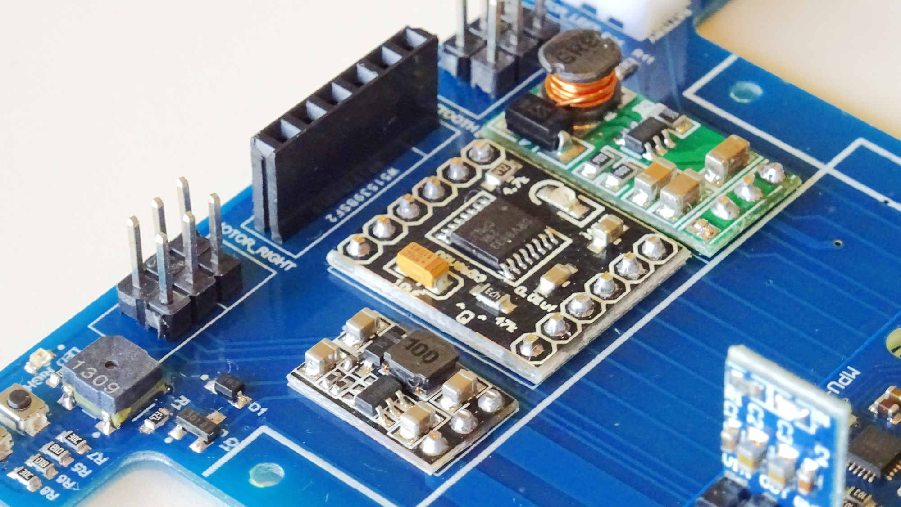

.. _building:

********
Building
********

Introduction
============

Bulebule is an open and freely distributed micromouse design. If you plan on
starting your own micromouse, you may consider at least having a look at how it
is built for reference!

Most of the components are easy to find, easy to solder and cheap. The only
exception are the motors, which we found second-hand but otherwise could be
really expensive.

   Bulebule micromouse.

If you build your own Bulebule, even if it is an exact copy, share your work!
It will help others even if only by encouraging them to build their own.
|:blush:|

If you make modifications and end up with a new version, perhaps with cheaper
motors, different sensors or whatever you come up with, share your work too!
|:heart_eyes:|

.. index:: board

Board
=====

Design
------

The board design is published under a `Creative Commons Attribution-ShareAlike
license`_.

You can check more details like the list of materials and the Gerber files in
the `Bulebule Upverter project page`_.

.. raw:: html

   <iframe height="600px" width="100%" frameborder=0
    src="https://upverter.com/eda/embed/?#tool=pcb,designId=fe25b467d88d5afe">
   </iframe>

.. index:: soldering

Soldering
---------

.. note:: You may want to read the full soldering instructions before starting
   to solder your first component.

The board, which is the base of the robot, is a simple 2-layer PCB. Most of its
components are through-hole, which means they should be easy to solder.

   Bulebule PCB.

You should start by soldering the smallest (SMD) components first: resistors,
capacitors, MOSFETs, LEDs, switches, diodes and the speaker.

   Always start with the smallest components.

When you are done with the SMD components, you may proceed with all the
on-board modules like the motor controller, the DC-DC converters and the gyro.

Among them, you only need to take special precaution with the gyroscope board,
which should be soldered with (virtually) no separation between the base PCB
and the module. This is to be able to solder the microcontroller board
afterwards.

   The gyroscope needs to be soldered with "no separation" from the board.

You can do the same with other on-board modules, but it is no necessary nor
really recommended unless you really feel comfortable with soldering.

   Proceed to solder other modules and the pin headers too.

Before we solder the `Blue Pill`_, we need to make sure we desolder one little
resistor from the back of the board. In particular, the R10 resistor, connected
to the USB on the board, which we will not be using.

   Remove the R10 resistor from the microcontroller board.

We would recommend you to desolder the microcontroller programming pins (in a
horizontal position) and solder new ones in a vertical position instead, to
ease connection when programming.

   Replace the horizontal programming pins with vertical pins instead.

Last, but not least, you should cover the emitters and receivers with some
heat-shrink tubing to increase precision in your readings. Only then, proceed
to solder them on to the board.

   Cover the emitters and receivers with heat-shrink tubing.

Solder them horizontally (or parallel to the board/floor) so that they point to
the walls when solving the maze!

   Solder the emitters and receivers horizontally and close to the PCB.

.. index:: locomotion

Locomotion
==========

.. index:: motors, encoders

Motors and encoders
-------------------

The motors are a pair of `Faulhaber 1524B009SR`_, which have the following
basic characteristics (at 22ºC and nominal voltage):

====================  =====  ======
Name                  Value  Unit
====================  =====  ======
Diameter              15     mm
Length                24     mm
Nominal voltage       9      V
Terminal resistance   10.6   Ω
No-load speed         10000  rpm
No-load current       0.009  A
====================  =====  ======

With the following rated values for continuous operation:

====================  =====  ======
Name                  Value  Unit
====================  =====  ======
Rated torque          2.9    mm
Rated current         0.38   A
Rated speed           4500   V
====================  =====  ======

The motors have attached `IE2-512 quadrature encoders`_, with 512 lines per
revolution.

.. index:: gears, tires

Design
------

We are following a `Tetra locomotion design`_. The motors we have found come
with a pinion attached to the shaft. The pinion has a 4.5 mm reference diameter
and 15 teeth, which means it has modulo 0.3.

Taking into account the target robot size, the design restrictions and also the
availability of tires and gears in local hobby/slot shops, we decided to go
with:

- `60 teeth gears`_ (18 mm reference diameter and less than 19 mm external
  diameter).
- 20 mm tires (`Slot.it PT18`_; suitable for smooth and clean surfaces).

.. index:: bearings, axis

Bearings and axis
-----------------

The bearings are some `MR63ZZ`_ (3 mm inner diameter, 6 mm outter diameter
and 2.5 mm width).

.. index:: rim

Rim
---

The rim has been designed with `CadQuery`_. See the `Bulebule 3D designs`_.

.. cadquery:: ../../3d/rim.py
   :select: rim

.. index:: mounting

Mounting
--------

The mounting has been designed with `CadQuery`_. See the `Bulebule 3D
designs`_.

.. cadquery:: ../../3d/mount.py
   :select: mount

.. index:: assembly

Assembly
--------

In order to assemble the locomotion system, we first need to make the wheels.
Starting from making a hole in the center of the gears that should be bigger
than the bearings. The hole should be centered for stabilization purposes, but
it is really not critical.

   Make a hole in the center of the gears.

Once you have the gears ready, you need to insert a pair of bearing in the rim,
one on each side. Using flanged bearings may help here. Put the tire around the
rim and then proceed to *carefully* glue the gear to the rim with some epoxy.

The gear must be centered with respect to the rim. While the epoxy is
hardening, make sure to rotate the wheel (put an M3 screw in the bearings to
make the wheel rotate easily) and ensure there are no deviations.

This glueing process is very delicate. You will have just a couple of seconds
to make effective corrections on the gear position, while the epoxy is hard
enough to maintain any corrections you apply but not completely solid.

   Insert a pair of bearings in the rim and glue the gear to the rim.

Finally, use some M3 screws to attach the wheels to the mount. Put a nut in
between the wheel and the mount, that will help separate the gear from the
mount.

   Une an M3 screw to attach the wheels to the mount.

Then put another nut at the other (inner) side of the mount and tighten it. The
two nuts will make a sandwich with the mount and make sure the screw does not
move.

Finally, attach the mount to the PCB with some M2 screws.

   Attach the mounts to the PCB with some M2 screws and you are done!

Congratulations! Now you should be ready to try your micromouse! |:tada:|

References
==========

.. target-notes::

.. _`Bulebule Upverter project page`:
   https://upverter.com/design/bulebots/bulebule/
.. _`Creative Commons Attribution-ShareAlike license`:
   https://creativecommons.org/licenses/by-sa/4.0/
.. _`CadQuery`:
   https://github.com/CadQuery/cadquery
.. _`Faulhaber 1524B009SR`:
   https://www.faulhaber.com/fileadmin/Import/Media/EN_1524_SR_DFF.pdf
.. _`IE2-512 quadrature encoders`:
   https://bulebots.readthedocs.io/en/latest/ie2-1024_encoder_family.html
.. _`MR63ZZ`:
   http://www.rcbearings.com/products/mr63zz-3-x-6-x-2-5-bearing.html
.. _`60 teeth gears`:
   http://www.mootio-components.com/engranajes-de-plastico/modulo-0.300/dientes-60z
.. _`Slot.it PT18`:
   http://slot.it/immagini/KitPart/tires/Slot-it_tabella-2015.jpg
.. _`Tetra locomotion design`:
   https://bulebots.readthedocs.io/en/latest/tetra.html
.. _`Bulebule 3D designs`:
   https://github.com/Bulebots/bulebule/tree/master/3d
.. _`Blue Pill`:
   https://web.archive.org/web/20190524151648/https://wiki.stm32duino.com/index.php?title=Blue_Pill
